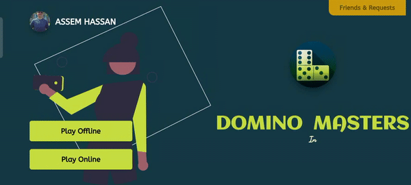
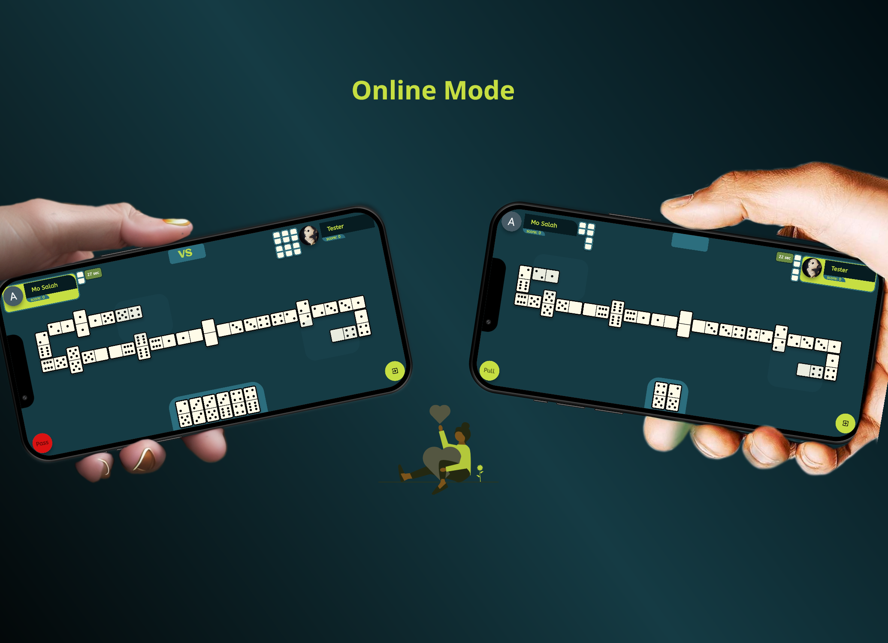
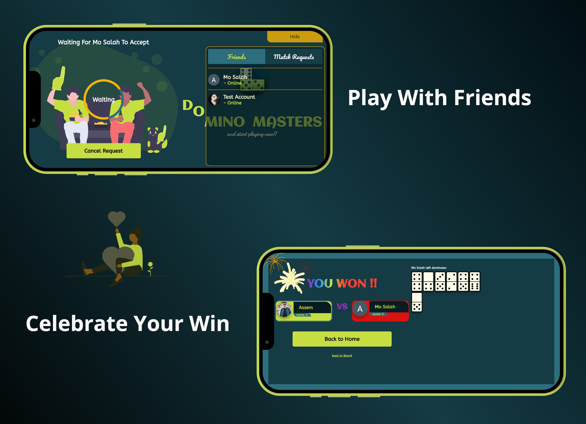
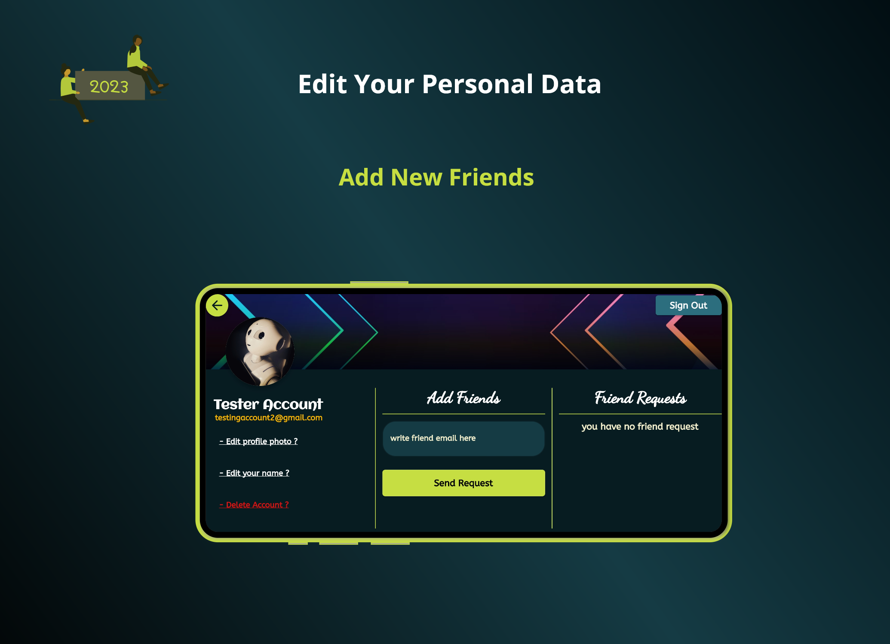

# Domino Masters

With Domino Master, you can enjoy the classic game of dominoes anytime, anywhere. Play offline against our intelligent bot opponent, or challenge your friends and family online to see who can come out on top. 

## Installing

1. Install Flutter SDK from https://flutter.dev/docs/get-started/install
2. Install Android Studio or Visual Studio Code
3. Clone the repository from GitHub
4. Open the project in Android Studio or Visual Studio Code
5. Setup Firebase Project
6. Run flutter pub get
7. Run the project on an emulator or physical device

## Screenshots

 

